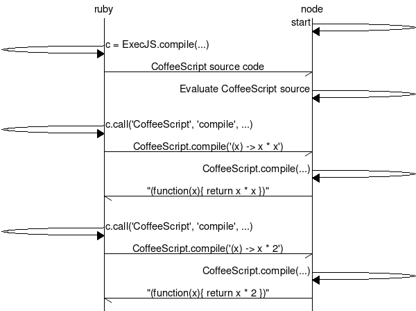
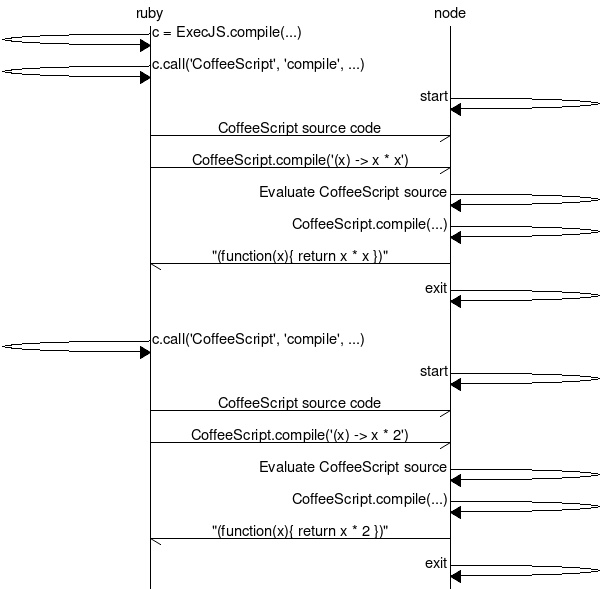

# ExecJS FastNode

## What's this?

An alternative implementation of ExecJS's Node.js integration. This aims to speed up sprockets compilation without needing to embed a javascript interpreter inside of ruby like [therubyracer](cowboyd/therubyracer).

## How much faster is it?

Much.

```
$ rake bench
...
                               user     system      total        real
Node.js (V8) fast   0.000000   0.000000   0.000000 (  0.069723)
therubyracer (V8)   0.020000   0.000000   0.020000 (  0.018010)
Node.js (V8)        0.000000   0.010000   1.470000 (  1.487579)
```

Okay, so it's not as fast as `therubyracer`, but it's 20x faster than the standard ExecJS Node.js implementation.

The benchmark measures the time to compile the javascript CoffeeScript compiler and then eval a small snippet 10 times.

## How?

The existing ExecJS runtime has to run a new Node.js process each time any JS is to be run. This means that if you are loading up the CoffeeScript compiler in order to compile some sprockets assets, it needs to reload the node executable and the entire coffeescript compiler for each file it is compiling.

This implementation avoids this by starting an always running Node.js process connected by pipes to STDIN and STDOUT. The JS to execute is piped into the process and the results are recieved from its output. Isolation between different ExecJS contexts is achieved through Node's [vm.Script](https://nodejs.org/api/vm.html).

| ExecJS FastNode | Standard ExecJS Node |
| --- | --- |
|  |  |

## Is this production ready?

Maybe? It needs more testing to be labeled as such. If you encounter any troubles please [file an issue](https://github.com/jhawthorn/execjs-fastnode/issues/new).

Currently minimal effort is made to handle catastrophic errors: Node.js crashing, running out of memory, being killed. All of which result in `Errno::EPIPE: Broken pipe` for future ExecJS calls.

It's probably fine for development.

## Installation

Add this line to your application's Gemfile:

```ruby
gem 'execjs-fastnode'
```

And then `bundle install`. You know the drill.

You can verify that this runtime is being autodetected and used by checking `ExecJS.runtime` in a console.

You can force a certain runtime to be used using `EXECJS_RUNTIME=FastNode`

```
$ EXECJS_RUNTIME=FastNode bin/console
> ExecJS.runtime
=> #<ExecJS::FastNode::ExternalPipedRuntime:0x005599c0d38740 @name="Node.js (V8) fast"...

$ EXECJS_RUNTIME=Node bin/console
> ExecJS.runtime
=> #<ExecJS::ExternalRuntime:0x00559c440347c0 @name="Node.js (V8)" ...
```

## Why not upstream this to execjs?

I'd like to, but it will take time. The goal of this endeavour is to give users a fast ExecJS runtime without needing any additional dependencies, just a Node.js installation. However most users don't (and shouldn't have to) think about ExecJS and need it to Just Work. This is a pretty significant change and it probably won't "Just Work" right now, and more time is needed to tell if it can.

I have sent a pull request upstream to [use vm.runInContext](https://github.com/rails/execjs/pull/55), which would be the first step to merging this upstream.

## Why not just use therubyracer?

Maybe you should, if you need the speed.

Heroku [recommends againts it](https://devcenter.heroku.com/articles/rails-asset-pipeline#therubyracer) as do various stack overflow answers with vague mentions of high memory usage.
I haven't seen any benchmarks or bug reports that demonstrate this, so I consider these claims somewhat suspect.

[mini_racer](https://github.com/discourse/mini_racer) is another option.

The ExecJS Node runtime has its benefits as well. It should works on jRuby and other non-MRI runtimes.
If this were merged upstream it would give developers fast javascript execution without needing an extra gem or configuration, just a working `node` somewhere in `$PATH`.

## Development

After checking out the repo, run `bin/setup` to install dependencies. Then, run `rake test` to run the tests. You can also run `bin/console` for an interactive prompt that will allow you to experiment.

To install this gem onto your local machine, run `bundle exec rake install`. To release a new version, update the version number in `version.rb`, and then run `bundle exec rake release`, which will create a git tag for the version, push git commits and tags, and push the `.gem` file to [rubygems.org](https://rubygems.org).

## Contributing

Bug reports and pull requests are welcome on GitHub at https://github.com/jhawthorn/execjs-fastnode.


## License

The gem is available as open source under the terms of the [MIT License](http://opensource.org/licenses/MIT).

